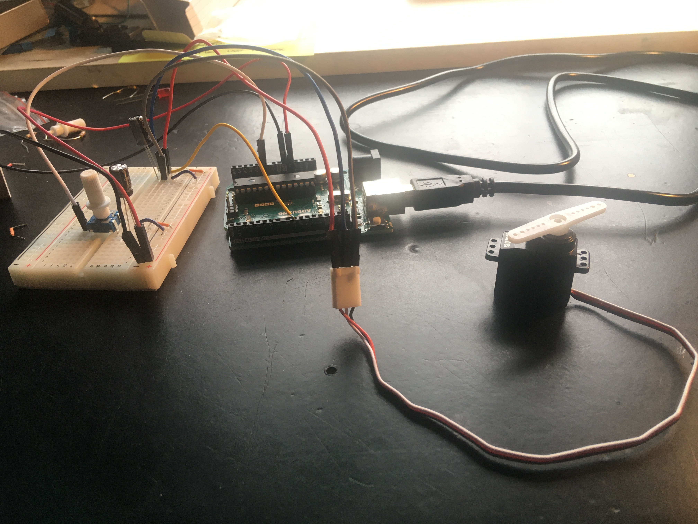
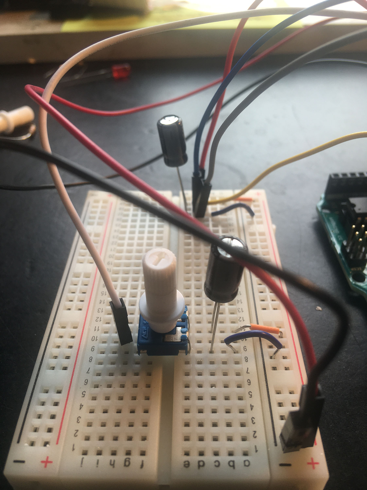

# Unit 3 Creative Practice: Visual Coding and Physical Computing
This repository contains information and code for the physical computing unit for the Diploma in Creative Computing of the Creative Computing Institute.

The Unit will be using Arduino's to explore physical computing. It will also explore how physical and digital computing can be integrated to create interactive systems. By using the idea of play you will be creating interactive physical systems using a range of inputs and outputs. 

## Physical Computing
 Physical computing allows you to create programmed systems that are manifested with physical objects. This could be objects that sense and interact with the world, that respond to data, that send data that change other systems, or a mixture of the three.

## Assessment
To be added add link to brief

## Play
In this unit you will be creating a physical computing project based around play. Play can be many things, it could be a game, imaginary situations or explorational. It is enjoyable, imaginative, mainly voluntary and active.

## References
These are some of the materials I used as reference when writing this unit:

Arduino projects book [pdf](https://bastiaanvanhengel.files.wordpress.com/2016/06/arduino_projects_book.pdf)

Instructables [website](https://www.instructables.com/) - various Arduino projects

Arduino [website](https://www.arduino.cc/)

Rules of play - game design fundamentals by Katie Salen Tekinbaş and Eric Zimmerman 

Seriously Considering Play - Designing interactive learning environments based on the blending of microworlds, simulations, and games by Lloyd P. Rieber 1996

The Infinite Playground, A players guide to the imagination - Bernard De Koven with Holly Gramazio

## Safety 

In this unit you will be working with electricity and electrical components. Safety has to be considered when working with electricity. When working on Arduino projects: 

- Make sure that the Arduino is disconnected from its power source when you are attaching components, this power source maybe through the USB attachment to your computer or an external battery. 
- All the projects in the book either use 5V (power from the USB) or 9V (through a battery). At this point you shouldn't go above this voltage for the Arduino.
- If a component gets overly hot, or you smell burning disconnect the power supply from the Arduino. 
- There are some components that will overheat if they are not connected correctly, such as the temperature sensor, if it starts to get hot, disconnect the power supply 
- Capacitors need to have the power and ground going to the correct pin, it they don’t they can explode 

## Week 1 - Thursday 22nd October 2020: Introduction to JavaScript and Node.js
If you want to mix physical components with digital interfaces and create visual outputs, a browser page is a good way to do it. This means getting to know some web languages including HTML, CSS and JavaScript. This workshop will be an introduction to JavaScript and Node.js, as well Socket.io a library that lets you create multiuser interactive web pages. It will also be an introduction to the unit, showing examples of physical computing projects, and introducing the idea of play.

### Week 1 materials
Week 1 [slides](https://developdata.github.io/unit3_week_01)

Getting started [with JavaScript]( https://glitch.com/edit/#!/start-javascript)

Setting up [Node.js]( https://glitch.com/edit/#!/start-nodeapp)

Introduction to [Websockets]( https://glitch.com/edit/#!/start-sockets)

### Homework
Go back through all three glitch projects, play around with them and remix them.

Install the Arduino integrated development environment (IDE) onto your computer.

If you haven't got Node.js installed on your computer, install it, in week four we will start creating a web server that will take in data from an Arduino.  

I've put instructions for these installations in the week 2 [README](https://github.com/developdata/CCIDiploma-Unit3/blob/master/week2/README.md). 

Download [visual studio code](https://visualstudio.microsoft.com/free-developer-offers/) its a free development environment. 

## Week 2 - Thursday 29th October 2020: Introduction to Arduino
This workshop is an introduction to Arduino. There will be a demonstration on setting up the Arduino programming environment and getting started with some basic components. You will start to connect components to an Arduino and write a short program.

### Week 2 materials
Week 2 [slides](https://developdata.github.io/unit3_slides/week_02/#0)

Arduino projects book [pdf](https://bastiaanvanhengel.files.wordpress.com/2016/06/arduino_projects_book.pdf) I have added some notes at the bottom of this Readme file about some of the projects.

Week 2 [folder](https://github.com/developdata/CCIDiploma-Unit3/tree/master/week2)

### Homework
Over the next four weeks, in groups of three you will be working through the Arduino project book as homework. 

## Week 3 play
This week will be a look at how games are designed, this should help you think about what you want to develop during this unit, and how to incorporate play into the piece.

### Week 3 materials
Write your rules exercise [link](https://write-your-rules.glitch.me/)

## Arduino Project Book notes 
As I’ve been going through the project book again, I’ve been noting down things that might be helpful, things that I had to do slightly differently, or didn’t give me the expected result. 

### Project 2 – Spaceship interface 
I found that the LED’s were quite faint in this project, I initially didn’t think it was working, but when I made my workspace darker, I could see they were coming on correctly. 

### Project 3 – Love-o-meter 
I initially had the temperature sensor the wrong way around, it became very hot, if this happens unplug the Arduino from the power source. As the serial monitor is used in this project it is also easy to see that the temperature is too high, as it will show in the monitor. 

### Project 5 – Mood Cue 
This project uses capacitors, so make sure that they are the right way round, with the cathode going to ground. 

I also found that the header pins were too short, I ended up using my own leads and not connecting the servo directly to the breadboard but via the leads. Also, on my servo the white lead twists as it leaves the servo, so it is attached to the centre pin when I attached it to the Arduino. This is something you could check if your servo doesn’t work. You can this this in the picture below, as well as the leads connecting the servo to the breadboard. 

 

There is a potentiometer in this project, in the book it looks like all pins are placed on one side of the breadboard. I couldn’t do this with the potentiometer I had so I had the middle pin on the other side of the breadboard and the wire for that pin was on the same side. The photo below illustrates this.  

 
