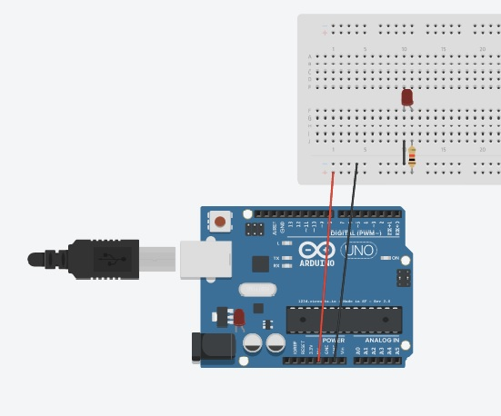

# Week 1 - Introduction to Arduino
This folder contains information and code for week 1. There are two .ino files, one is the blink file that is in the examples in the Arduino IDE, the other is the .ino file for using a switch to turn a light on and off.

## Week 1 materials
Week 1 [slides](https://developdata.github.io/unit3_week_01)

Arduino projects book [pdf](https://bastiaanvanhengel.files.wordpress.com/2016/06/arduino_projects_book.pdf)

## Getting started with Arduino
Arduino is an open source electronics platform that allows anyone to make interactive electronic projects. There are different types of Arduino, the one you have in this unit is a Leonardo.

## Download IDE 
An IDE is an integrated development environment, it has extra features to help you code. There is an IDE for Arduino that is easy to install, you can use an online version, but I have found it easier to have it downloaded locally on my computer. To download the Arduino IDE: 

1. Go to the download page on the Arduino https://www.arduino.cc/en/Main/Software 
2. Go down the page until you see Download the Arduino IDE and choose the right version for you from the list on the right hand side - I chose Windows Installer for my PC 
3. This will open a new page which will let you contribute and download or just download 
4. Once the file is downloaded double click on it to install 

## Arduino Basics
An Arduino is an electronics board with a microcontroller on that you can program. These programs are called Sketches, which have an .ino extension and can be created using the Arduino IDE. Once you have written your code you need to upload it to your Arduino, you do this by connecting your Arduino to your computer via USB and then downloading it to the Arduino. In order to do this the Sketch needs to know which Arduino you are using and which port it is connected to. 

Computers have a series of ports that you can connect devices to, such as a keyboard or mouse. These ports could be USB, VGA or Ethernet, each port has a number. 

## Safety 

In this unit you will be working with electricity and electrical components. Safety has to be considered when working with electricity. When working on Arduino projects: 

- Make sure that the Arduino is disconnected from its power source when you are attaching components, this power source maybe through the USB attachment to your computer or an external battery. 
- If a component gets overly hot, or you smell burning disconnect the power supply from the Arduino. 
- There are some components that will overheat if they are not connected correctly, such as the temperature sensor, if it starts to get hot, disconnect the power supply 
- Capacitors need to have the power and ground going to the correct pin, it they don’t they can explode 

### The Blink Sketch 
The Arduino comes with a number of example sketches you can use. The simplest is the Blink sketch, which tells the light that’s on the Arduino to blink on and off.

1. Open the Arduino IDE 
2. Open up the blink.ino, it can be found in the file menu File/Examples/O1.Basics/Blink 
3. Attach your Arduino to a USB port on your computer 
4. Check the right board is selected in the Tools menu, under board it should say the name of your type of Arduino, if it doesn't open go to the Arduino AVR Boards dropdown and choose your board 
5. In the tools menu check that there is a port selected 
6. Verify the sketch by pressing on the tick icon on the sketch 
7. Once verified, upload the sketch to your Arduino using the right pointing arrow icon 

8. At the bottom of your sketch you should see information about the upload and any errors. One of the most common errors is the wrong port, if you get this, try changing the connection to the USB port on your computer and upload again
#### The sketch explained
When you create a new sketch there are always two functions listed. Functions are small pieces of code that do specific things. In the sketch there is a setup function and a loop funciton. The set up function is called once at the beginning. You can use it to set up any information you want the program to know, such as pin numbers. The other function is a Loop function. This function will be called multiple times, once the code has been processed once by your Arduino it will start again at the top, it will read the code top to bottom. 

`pinMode(LED_BUILTIN, OUTPUT);`
This tells your Arduino the built in LED will be used, this correspond to Pin 13, it tells it there will be an output.
`digitalWrite(LED_BUILTIN, HIGH);`
This line of code turns the light on, it takes the pin to 5V 
`delay(1000)`
This creates a delay before the next line of code is processed. It is milliseconds, so 1000 will be one second
`digitalWrite(LED_BUILTIN, LOW);` 
This turns the light off, it takes the pin to 0V 
### Blink with a light 

The next thing is to add an external LED which blinks, it uses the same code but an LED is connected to the Arduino.  

When you are making changes to the components attached to an Arduino you should unplug it from its power supply, in this case by unplugging the USB. 

Connect the components as seen in the image below, it shows an Uno, but it should be the same set up on a Leonardo. When you connect it again the LED should be blinking.

LED’s have two legs, one is positive (anode) and the other negative (cathode), the positive leg is the longer leg.  

### Button
You can write some code so that the button becomes a toggle to turn the light on and off. For this you the Arduino needs to remember the current state and when the button is pressed toggle to the other state. For this you will need to use variables in your code. You can write some code so that the button becomes a toggle to turn the light on and off. For this you the Arduino needs to remember the current state and when the button is pressed toggle to the other state. For this you will need to use variables in your code. 

You can store values in variables that you can then use throughout your code. Sometimes these values will be constant, which means you can’t change the value in them once you’ve set it. Others can be changed, so the value will change at different points in the code.

Set up the Arduino and components as you see in the diagram. Attach the Arduino to the computer. Copy the .ino code and paste it into a new sketch and save it. Verfiy the code, then upload it to your Arduino.

There is a lot more code in this sketch, and it introduces some new programming concepts 

#### Variables
`// this constant won't change: 

const int  buttonPin = 2;    // the pin that the pushbutton is attached to 

const int ledPin = 13;       // the pin that the LED is attached to 

// Variables will change: 

int buttonPushCounter = 0;  // toggles between 0 and 1 to specify if the light is off or on 

int buttonState = 0;         // current state of the button 

int lastButtonState = 0;     // previous state of the button`
There are a number of variables at the top of the page, two are constants, using the const keyword first. In this programming language you need to declare what the variable will be holding, for example a number or text. In this case all the variables are holding numbers so you use the word int, which stands for integer to declare them. You then give your variable a name, try and keep it to something that describes what it is holding. You can’t have spaces in the variable name, but you can use camel case to show different words. Most words can be used as variable names unless they are words used by the programming language, key words, such as int in this language. 

The two constant variables hold the numbers of the pins the button and LED are connected to. You could just add these numbers into the code, but putting them in variables makes it neater and easier if at some point you want to change the pin number (you don’t need to go through the code and change it everywhere, you can just change it in the variable declaration. 

#### Setup
`void setup() { 
  // initialize the button pin as a input: 
  pinMode(buttonPin, INPUT); 
  // initialize the LED as an output: 
  pinMode(ledPin, OUTPUT); 
}`
In the set up the code is saying which pin is an input (the button) and which is an output (the LED) 
#### The Loop
`// read the pushbutton input pin: 
  buttonState = digitalRead(buttonPin);`

The loop starts by reading the current state on the button. Every time the Arduino loops through the code it will check this state. 
`if (buttonState != lastButtonState) {`
There is then a check to see if the state of the button has change, whether the button has been pressed, if is not the same as it was last loop. If it has changed there is another if statement.
`if (buttonPushCounter == 0){ 

        digitalWrite(ledPin, HIGH); 

        buttonPushCounter = 1; 

      } else { 

        buttonPushCounter = 0; 

         digitalWrite(ledPin, LOW); 

      }`
This time the check is to see the state of buttonPushCounter,  and toggle the light on and off with the digitalWrite. The variable buttonPushCounter has to be changed so that in the next loop, if the button has been pressed the LED will either turn on or off. 
`delay(50);`
Add in a delay, this is so there is time for the Arduino to make the changes to the components before the loop goes round again 
`lastButtonState = buttonState;`
The lastButtonState variable is updated with the current button state so it will be correct on the next loop
## Troubleshooting
You might get an error when uploading your Sketch 

### Finding the port your Arduino is connected to 

 - Mac 
	- Open terminal and type: ls /dev/*. 
    - Note the port number listed for /dev/tty.usbmodem* or /dev/tty.usbserial*. The port number is represented with * here. 
- Windows 
    - Open the device manager – in the windows search start typing device manager and when you see the folder name click on it 
    - In the list of devices open up the Ports (COM & LPT) you should be able to see the Arduino with its port number next to it e.g. COM7 
- Linux 
    - Open terminal and type: ls /dev/tty*. 
    - Note the port number listed for /dev/ttyUSB* or /dev/ttyACM*. The port number is represented with * here. 
    - Use the listed port as the serial port in MATLAB®. For example: /dev/ttyUSB0. 