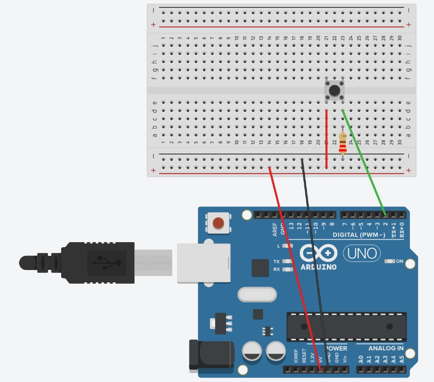

# Week 4: Arduino Data to a Web Page
This week we will start looking at how to send data from an Arduino to a web page. You will be doing this by creating a Node.js application. This application will have code so you can use your computer as a local server, as well the code needed to get the data from the Arduino. 

You will be using visual studio code, Arduino, and Node.js to do this. You will also be referencing the port your Arduino is attached to bring in the data. I will go through getting started with Visual Studio code and setting up the folder and files for the Node.js server. Then I will go through the connection to the Arduino and how to transfer data from the Arduino, to the server, to a web page.

## Arduino Setup
### Hardware
You will need an Arduino, a button component, a 220-ohm resistor, a bread board and 4 jump wires. The connection of the button to the Arduino is shown below:


### Code
The code checks if the button has been pressed, if it has and and it has just been pressed, the value is printed out to the serial monitor. This is the data that will be sent to the Node.js application. The code is button_serial.ino

## The Node.js Application
A Node.js application is used to recieve the data from the Arduino and send it to a web page. The data is sent through a serial port on the computer. The Node.js application uses a library called SerialPort to recieve and parse the data. You can see the final application code in the button_data folder.

### Serial Port
A serial port is a port on your computer used to attach devices. When you connect your Arduino to your computer you need to tell it which port on the computer your Arduino is connected to. Your Arduino receives data from this port when you upload a sketch, it can also send data through this port to your computer.  

The data is sent in and out of your computer in single bits or 0 or 1 (binary). These bits are joined together to send complex data. The Arduino Leonardo and Uno uses Pin 0 (RX) for receiving data and Pin 1 (TX) for transmitting data. If you transmitting or receiving serial data you can not  use these pins for anything else. 

If the Node.js server is running and collecting data from the Arduino, that port the Arduino is attached to is in use. If you want to update your Arduino you will need to stop the server or you will get an error.

### Creating a local Node.js Application 
Create a folder for your Node application and give it a anme. You will be creating your own file structure for your Node.js application, but you can use npm to initialize the application. It will create a package.json file for you at the root of your application, which contains the data about the application, its metadata. It will also keep track of any libraries and their version that you installed; these are the applications dependencies. 

1. In visual studio code you should be in the root folder for your application, you can see this in the explorer 

2. Open up the terminal in Visual Studio Code, this is found in the menu `Terminal > New Terminal`. If you are using an external terminal, navigate to the folder 

3. In the terminal write `npm init` to create the package.json file for the application 

4. There will be a number of questions to go through, you can make changes or press return for each one, you don’t have to decide at this point as you can make changes in the package.json file later 

5. When prompted, press OK to finish the initalization

### Create a .gitignore file
Now is a good time to make a gitignore file. The modules you download are big, and so you don’t really want them to be saved with git as they would then upload to say github which would take up space and take along time to upload. To stop them being saved to git you create a .gitignore file, files and folder paths named in the file won't be in your git commits. This is one of the reasons the package.json file is so important, as if you load the code for this application on another computer, you know which dependencies you need to download. 

The gitignore file has a dot infront of it, this means it’s a hidden file, you won’t notice it in the list of documents on the computers file explorer. To create one: 

1. Create a new file in the root of your application, and call it `.gitignore`

2. In the new file write `node_modules/` and save the file

You can see the .gitignore file I created in the button_data application folder.

### Installing Express
Express needs to be added to the application as a dependency, to do this:

1. Go to the terminal window, and make sure you are in the root folder for you app 

2. Type in npm i express, the i stands for install, it is installed for this app only. It will install in under a minute 

3. Look at your package.json file, Express is now in the dependencies, with its version number listed 

### Creating the server
In the root of your application create a file called server.js and copy in the code below:
```
const express = require("express"); 

const app = express();

const listener = app.listen(3000, () => { 

    console.log("Your app is listening on port " + listener.address().port); 

});
```

These 5 lines of code will allow you to run a local server on your computer. Once this code is in your server.js file, save the file.     

This code created a server at port 3000, you could put another number in there and it would still work. In Visual Studio Code open a new terminal from the terminal menu, this should be at the root of your application. If you are using an external command line interface navigate to the root of the application. In terminal type ```node server.js ``` to start the server (or the name of your main server javascript file).

In the terminal you should see the console log of the port. If you go to a browser and type in `localhost:3000` a page will come up, but it will have an error, as the application doesn't know yet what to deliver to that page.

### Creating a route to display something on a web page
 Go back to your code and before you start the code that starts the server type in: 
```
app.get('/', function(req, res){ 
    res.send("Hi there"); 
}); 
```

The get function specifies a route to a web page, the forward slash is saying this is the page at the root of your application, what is shown with the root url, localhost:3000. At the moment it will send the words Hi There, which will be displayed on the page. 

As the code has been updated, you need to restart your server, to do this you stop the server by pressing ctrl + c, then restart it again by typing in node server.js 
