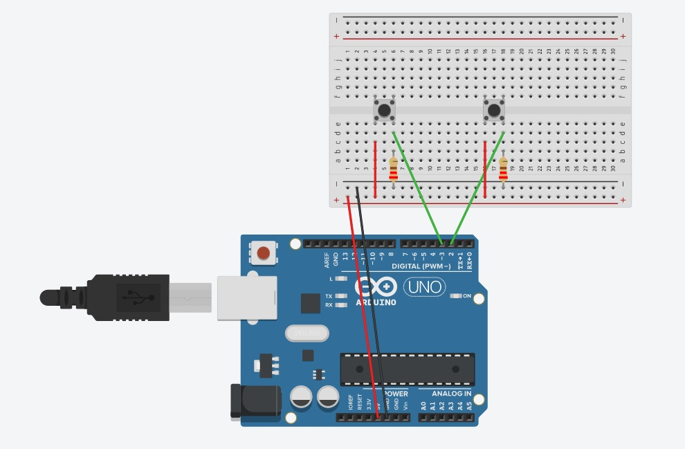

# Week 9 - Mixing Physical and Digital: Node.js and Arduino
The aim of this weeks workshop is to get comfortable using a Node.js server with an Arduino to pass data to create visualistions.

This will be done with a Node.js library called socket.io. socket.io has functions to let you pass data from the server to a web page, or a web page to a server as soon as that data arrives. 

This workshop will use Arduino and Node.js, with the Node.js libraries Express, serialport and socket.io.

## Homework
Create a simple Arduino set up and send data from to a Node.js application that visualises the data.

## Resources
Here are some resources relating to today's videos. There are folders for each step for creating the Node.js Arduino projects.
This is a general video on [how the internet works](http://www.youtube.com/watch?v=eiDcMY6YfEc). It talks about the architecture of the intenet and the web protocols.

## Folder and File Structures in Node.js applications
The code for this section is in 01_files_and_folders folder on this page.
In the video I mention favacons, this is some more information about them [favacons](https://www.seoptimer.com/blog/what-is-a-favicon/)

## Introduction to webSockets and socket.io
[How webSockets work](https://sookocheff.com/post/networking/how-do-websockets-work/)

## Adding the serialport module
The code for this section is on this page in the folder 02_adding_serialport.

## Arduino to a web page
The node.js project code for this seciton is in the folder 03_arduino_data. The ino file is in this folder and is called two_buttons.ino.

In this setup there are two buttons attached to an Arudino. This button data will be sent to the Node.js project which will update information on a web page. For the Arduino you will need:

- two buttons
- two 220 ohm resitors
- 6 jump leads

This is the diagram for the setup:

## Optional Content
Using a template engine to update a web page (EJS)
basic routing
